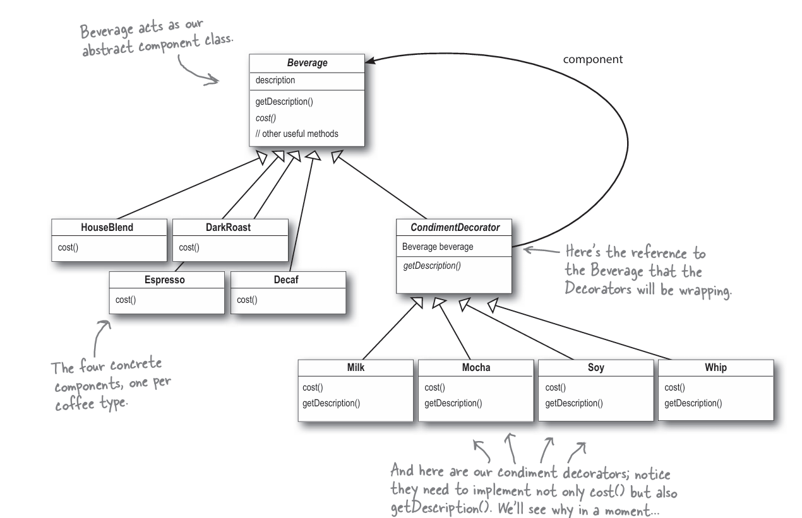

# Decorator Pattern

## What is the Decorator Pattern?

The Decorator Pattern is a structural design pattern that enables you to:

- Dynamically add behavior or responsibilities to objects without affecting their class
- Extend functionality in a flexible and reusable way
- Avoid subclassing for extending functionality

## When to Use the Decorator Pattern?

### 1. Adding Responsibilities Dynamically

When you need to add or remove responsibilities from objects at runtime.

**Benefits:**

- Avoids rigid class hierarchies
- Enables flexible behavior modification
- Supports open/closed principle

### 2. Extending Legacy Code

When you need to extend functionality of existing classes without modifying their code.

**Benefits:**

- Preserves existing functionality
- Reduces risk of introducing bugs
- Enhances maintainability

### 3. Combining Behaviors

When you need to combine multiple behaviors in a flexible way.

**Benefits:**

- Avoids exponential growth of subclasses
- Simplifies object composition
- Encourages single responsibility principle

## UML Diagrams for Decorator Pattern Examples

### Coffee Shop Example

This diagram illustrates the Decorator Pattern implementation in a coffee shop application:



This example demonstrate how the Decorator Pattern enables flexible and dynamic behavior extension.

## Implementation Guide

1. **Identify Core Component**

   - Define the base component interface
   - Implement the core component class

2. **Create Decorator Base Class**

   - Define a base decorator class that implements the component interface
   - Add a reference to the wrapped component

3. **Implement Concrete Decorators**

   - Create concrete decorator classes for each additional behavior
   - Override methods to add or modify behavior

4. **Client Implementation**
   - Compose objects dynamically using decorators
   - Ensure decorators adhere to the component interface

## Example

```typescript
/**
 * The base Component interface defines operations that can be altered by
 * decorators.
 */
interface Component {
 operation(): string;
}

/**
 * Concrete Components provide default implementations of the operations. There
 * might be several variations of these classes.
 */
class ConcreteComponent implements Component {
 public operation(): string {
  return "ConcreteComponent";
 }
}

/**
 * The base Decorator class follows the same interface as the other components.
 * The primary purpose of this class is to define the wrapping interface for all
 * concrete decorators. The default implementation of the wrapping code might
 * include a field for storing a wrapped component and the means to initialize
 * it.
 */
class Decorator implements Component {
 protected component: Component;

 constructor(component: Component) {
  this.component = component;
 }

 /**
  * The Decorator delegates all work to the wrapped component.
  */
 public operation(): string {
  return this.component.operation();
 }
}

/**
 * Concrete Decorators call the wrapped object and alter its result in some way.
 */
class ConcreteDecoratorA extends Decorator {
 /**
  * Decorators may call parent implementation of the operation, instead of
  * calling the wrapped object directly. This approach simplifies extension
  * of decorator classes.
  */
 public operation(): string {
  return `ConcreteDecoratorA(${super.operation()})`;
 }
}

class ConcreteDecoratorB extends Decorator {
 public operation(): string {
  return `ConcreteDecoratorB(${super.operation()})`;
 }
}

/**
 * The client code works with all objects using the Component interface. This
 * way it can stay independent of the concrete classes of components it works
 * with.
 */
function clientCode(component: Component) {
 // ...

 console.log(`RESULT: ${component.operation()}`);

 // ...
}

/**
 * This way the client code can support both simple components...
 */
const simple = new ConcreteComponent();
console.log("Client: I've got a simple component:");
clientCode(simple);
console.log("");

/**
 * ...as well as decorated ones.
 *
 * Note how decorators can wrap not only simple components but the other
 * decorators as well.
 */
const decorator1 = new ConcreteDecoratorA(simple);
const decorator2 = new ConcreteDecoratorB(decorator1);
console.log("Client: Now I've got a decorated component:");
clientCode(decorator2);
```

### Output

```
Client: I've got a simple component:
RESULT: ConcreteComponent

Client: Now I've got a decorated component:
RESULT: ConcreteDecoratorB(ConcreteDecoratorA(ConcreteComponent))
```
