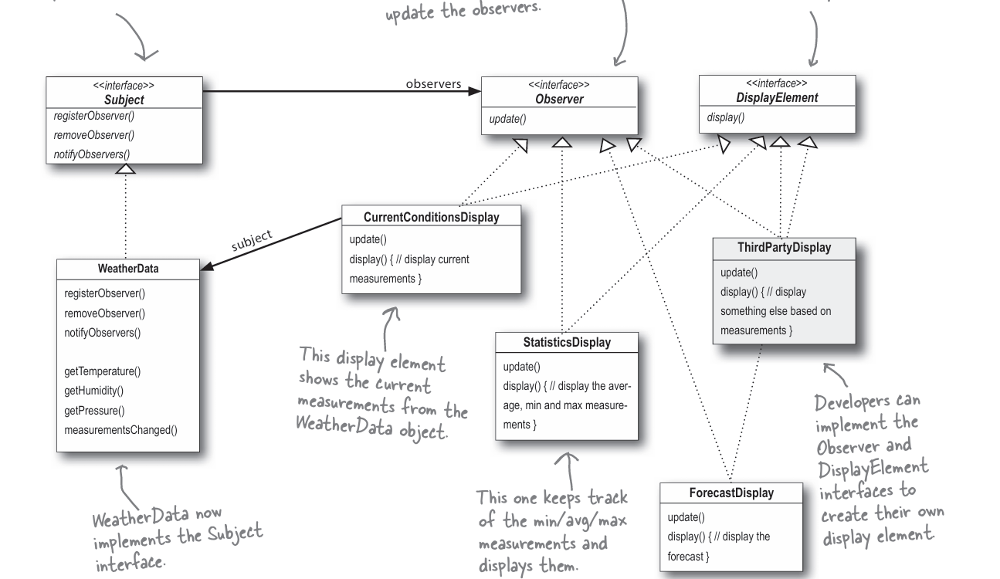

# Observer Pattern

## What is the Observer Pattern?

The Observer Pattern is a behavioral design pattern that enables you to:

- Define a one-to-many dependency between objects
- Notify multiple objects automatically when the state of a subject changes
- Decouple the subject from its observers

## When to Use the Observer Pattern?

### 1. Event Handling Systems

When you need to implement distributed event handling systems.

**Benefits:**

- Enables loose coupling between components
- Supports dynamic subscription and unsubscription
- Facilitates event-driven architectures

### 2. Real-time Data Feeds

When you need to provide real-time updates to multiple consumers.

**Benefits:**

- Ensures timely data delivery
- Maintains consistency across observers
- Supports multiple observer types

### 3. Model-View-Controller (MVC) Architecture

When implementing the MVC pattern, particularly for updating views when the model changes.

**Benefits:**

- Keeps views synchronized with model state
- Enables multiple views for single model
- Supports clean separation of concerns

## UML Diagrams for Observer Pattern Examples

### Weather Station Example

This diagram illustrates the Observer Pattern implementation in a weather monitoring system:



the Observer Pattern enables efficient state propagation and notification management.

## Implementation Guide

1. **Identify Subject and Observers**

   - Determine which object will act as the subject
   - Identify dependent objects that need notifications

2. **Create Subject Interface**

   - Define methods for attaching/detaching observers
   - Include notification mechanism

3. **Create Observer Interface**

   - Define update method for observers
   - Ensure interface is generic enough for various observer types

4. **Implement Concrete Subject**

   - Maintain list of observers
   - Implement notification logic
   - Manage state changes

5. **Implement Concrete Observers**
   - Store reference to subject
   - Implement update method
   - Register with subject

## Example

```typescript
/**
 * The Subject interface declares a set of methods for managing subscribers.
 */
interface Subject {
 // Attach an observer to the subject.
 attach(observer: Observer): void;

 // Detach an observer from the subject.
 detach(observer: Observer): void;

 // Notify all observers about an event.
 notify(): void;
}

/**
 * The Subject owns some important state and notifies observers when the state
 * changes.
 */
class ConcreteSubject implements Subject {
 /**
  * @type {number} For the sake of simplicity, the Subject's state, essential
  * to all subscribers, is stored in this variable.
  */
 public state: number;

 /**
  * @type {Observer[]} List of subscribers. In real life, the list of
  * subscribers can be stored more comprehensively (categorized by event
  * type, etc.).
  */
 private observers: Observer[] = [];

 /**
  * The subscription management methods.
  */
 public attach(observer: Observer): void {
  const isExist = this.observers.includes(observer);
  if (isExist) {
   return console.log("Subject: Observer has been attached already.");
  }

  console.log("Subject: Attached an observer.");
  this.observers.push(observer);
 }

 public detach(observer: Observer): void {
  const observerIndex = this.observers.indexOf(observer);
  if (observerIndex === -1) {
   return console.log("Subject: Nonexistent observer.");
  }

  this.observers.splice(observerIndex, 1);
  console.log("Subject: Detached an observer.");
 }

 /**
  * Trigger an update in each subscriber.
  */
 public notify(): void {
  console.log("Subject: Notifying observers...");
  for (const observer of this.observers) {
   observer.update(this);
  }
 }

 /**
  * Usually, the subscription logic is only a fraction of what a Subject can
  * really do. Subjects commonly hold some important business logic, that
  * triggers a notification method whenever something important is about to
  * happen (or after it).
  */
 public someBusinessLogic(): void {
  console.log("\nSubject: I'm doing something important.");
  this.state = Math.floor(Math.random() * (10 + 1));

  console.log(`Subject: My state has just changed to: ${this.state}`);
  this.notify();
 }
}

/**
 * The Observer interface declares the update method, used by subjects.
 */
interface Observer {
 // Receive update from subject.
 update(subject: Subject): void;
}

/**
 * Concrete Observers react to the updates issued by the Subject they had been
 * attached to.
 */
class ConcreteObserverA implements Observer {
 public update(subject: Subject): void {
  if (subject instanceof ConcreteSubject && subject.state < 3) {
   console.log("ConcreteObserverA: Reacted to the event.");
  }
 }
}

class ConcreteObserverB implements Observer {
 public update(subject: Subject): void {
  if (
   subject instanceof ConcreteSubject &&
   (subject.state === 0 || subject.state >= 2)
  ) {
   console.log("ConcreteObserverB: Reacted to the event.");
  }
 }
}

/**
 * The client code.
 */

const subject = new ConcreteSubject();

const observer1 = new ConcreteObserverA();
subject.attach(observer1);

const observer2 = new ConcreteObserverB();
subject.attach(observer2);

subject.someBusinessLogic();
subject.someBusinessLogic();

subject.detach(observer2);

subject.someBusinessLogic();
```
