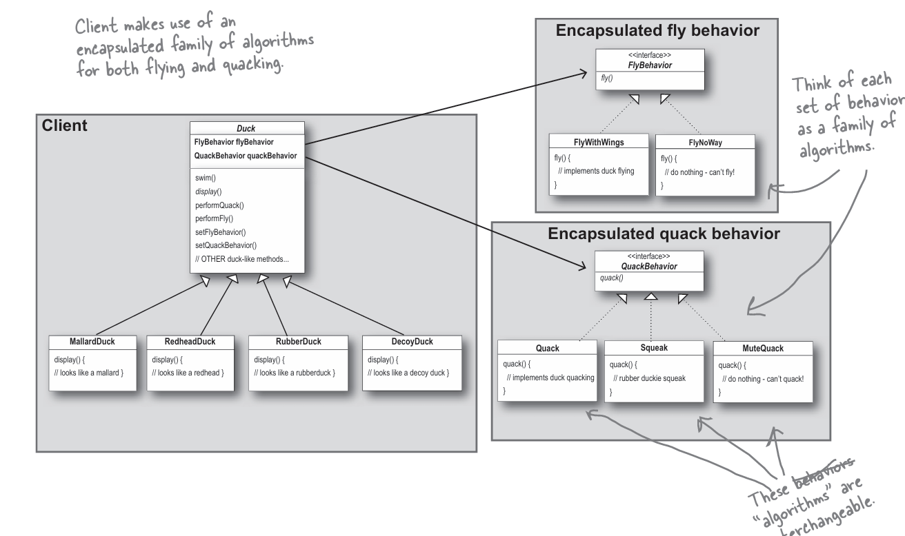
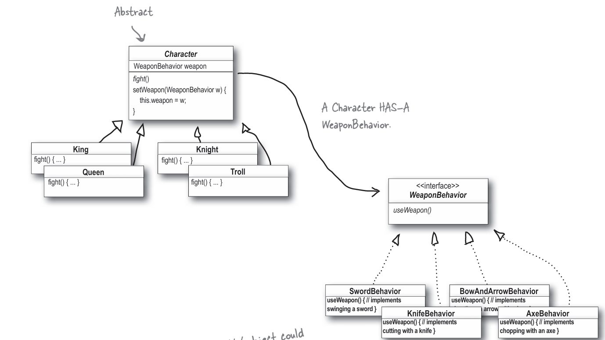

# Strategy Pattern

## What is the Strategy Pattern?

The Strategy Pattern is a behavioral design pattern that enables you to:

- Define a family of algorithms
- Encapsulate each algorithm
- Make the algorithms interchangeable at runtime

## When to Use the Strategy Pattern?

### 1. Dynamic Algorithm Switching

When you need to switch between different variants of an algorithm during runtime.

**Benefits:**

- Allows runtime behavior modification
- Enables indirect object behavior alteration through sub-object association
- Supports flexible task execution through different implementations

### 2. Similar Classes with Different Behaviors

When you have multiple classes that are identical except for their behavior implementation.

**Benefits:**

- Reduces code duplication
- Creates clean class hierarchy
- Consolidates common functionality

### 3. Business Logic Isolation

When you need to separate core business logic from algorithm implementation details.

**Benefits:**

- Clear separation of concerns
- Simplified client interface
- Easy runtime algorithm switching
- Improved maintainability

## UML Diagrams for Strategy Pattern Examples

### Duck Simulator Example

This diagram illustrates the Strategy Pattern implementation in a duck simulation application:



### Weapon System Example

This diagram shows how the Strategy Pattern is applied in a weapon system:



Both examples demonstrate how the Strategy Pattern enables flexible behavior management through composition rather than inheritance.

## Implementation Guide

1. **Identify Variable Algorithm**

   - Look for frequently changing algorithms
   - Consider replacing large conditional statements that select algorithms

2. **Create Strategy Interface**

   - Define common interface for all algorithm variants
   - Ensure interface captures essential behavior

3. **Implement Strategy Classes**

   - Create separate classes for each algorithm
   - Ensure all classes implement the strategy interface

4. **Configure Context Class**

   - Add strategy reference field
   - Implement strategy setter method
   - Use strategy interface for interactions
   - Consider adding data access interface

5. **Client Implementation**
   - Associate context with appropriate strategy
   - Ensure strategy aligns with expected behavior
   - Configure strategy based on requirements

## Example

```ts
/**
 * The Context defines the interface of interest to clients.
 */
class Context {
 /**
  * @type {Strategy} The Context maintains a reference to one of the Strategy
  * objects. The Context does not know the concrete class of a strategy. It
  * should work with all strategies via the Strategy interface.
  */
 private strategy: Strategy;

 /**
  * Usually, the Context accepts a strategy through the constructor, but also
  * provides a setter to change it at runtime.
  */
 constructor(strategy: Strategy) {
  this.strategy = strategy;
 }

 /**
  * Usually, the Context allows replacing a Strategy object at runtime.
  */
 public setStrategy(strategy: Strategy) {
  this.strategy = strategy;
 }

 /**
  * The Context delegates some work to the Strategy object instead of
  * implementing multiple versions of the algorithm on its own.
  */
 public doSomeBusinessLogic(): void {
  // ...

  console.log(
   "Context: Sorting data using the strategy (not sure how it'll do it)"
  );
  const result = this.strategy.doAlgorithm(["a", "b", "c", "d", "e"]);
  console.log(result.join(","));

  // ...
 }
}

/**
 * The Strategy interface declares operations common to all supported versions
 * of some algorithm.
 *
 * The Context uses this interface to call the algorithm defined by Concrete
 * Strategies.
 */
interface Strategy {
 doAlgorithm(data: string[]): string[];
}

/**
 * Concrete Strategies implement the algorithm while following the base Strategy
 * interface. The interface makes them interchangeable in the Context.
 */
class ConcreteStrategyA implements Strategy {
 public doAlgorithm(data: string[]): string[] {
  return data.sort();
 }
}

class ConcreteStrategyB implements Strategy {
 public doAlgorithm(data: string[]): string[] {
  return data.reverse();
 }
}

/**
 * The client code picks a concrete strategy and passes it to the context. The
 * client should be aware of the differences between strategies in order to make
 * the right choice.
 */
const context = new Context(new ConcreteStrategyA());
console.log("Client: Strategy is set to normal sorting.");
context.doSomeBusinessLogic();

console.log("");

console.log("Client: Strategy is set to reverse sorting.");
context.setStrategy(new ConcreteStrategyB());
context.doSomeBusinessLogic();
```

**OUTPUT**

```
Client: Strategy is set to normal sorting.
Context: Sorting data using the strategy (not sure how it'll do it)
a,b,c,d,e

Client: Strategy is set to reverse sorting.
Context: Sorting data using the strategy (not sure how it'll do it)
e,d,c,b,a
```
